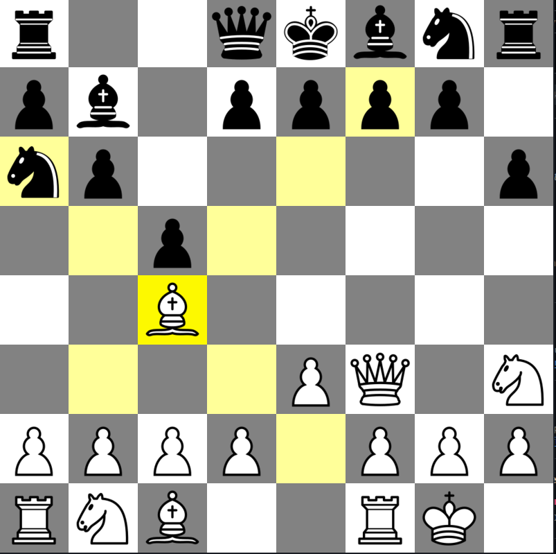

# ♟️ ChessRaylib

Um jogo de **xadrez completo** feito em **C++** usando a biblioteca **[Raylib](https://www.raylib.com/)**. O projeto implementa a maioria das regras oficiais do xadrez, com uma interface simples e jogabilidade fluida.

## ✅ Funcionalidades

- ✅ Movimentação legal de todas as peças
- ✅ Roque (curto e longo)
- ✅ Promoção de peões
- ✅ Alternância de turnos entre jogadores
- ✅ Tabuleiro gráfico com Raylib
- ✅ Indicação de jogadas válidas
- ✅ Tela de vitória quando o rei é capturado
